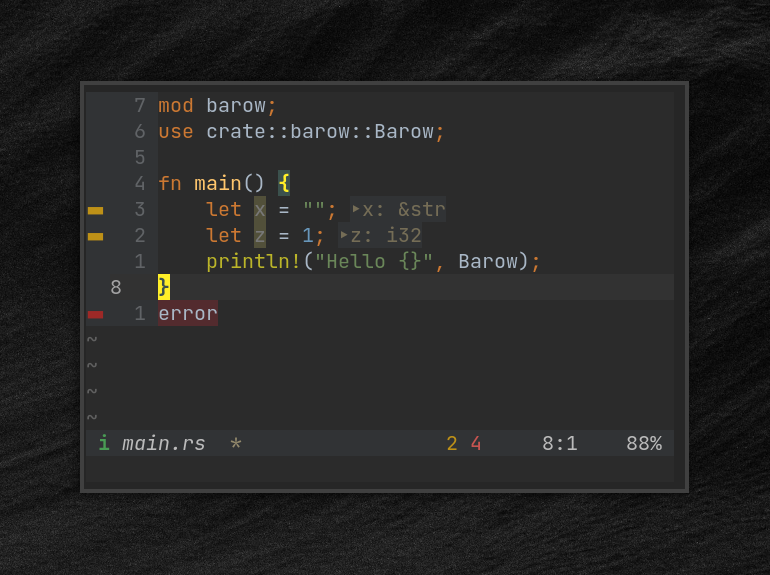

## Barow



A minimalist statusline for [n](https://neovim.io/)/[vim](https://www.vim.org/).

### install
If you use a plugin manager, follow the traditional way.

For example with [vim-plug](https://github.com/junegunn/vim-plug) add this in `.vimrc`/`init.vim`:
```
Plug 'doums/barow'
```

Then run in vim:
```
:source $MYVIMRC
:PlugInstall
```
If you use vim's native package `:h packages`.

### usage
Barow works out of the box.\
But if you want, here are all the options you can customize
```
" in .vimrc/init.vim

let g:barow = {
      \'modes': {
      \  'normal': [ ' ', 'BarowNormal' ],
      \  'insert': [ 'i', 'BarowInsert' ],
      \  'replace': [ 'r', 'BarowReplace' ],
      \  'visual': [ 'v', 'BarowVisual' ],
      \  'v-line': [ 'l', 'BarowVisual' ],
      \  'v-block': [ 'b', 'BarowVisual' ],
      \  'select': [ 's', 'BarowVisual' ],
      \  'command': [ 'c', 'BarowCommand' ],
      \  'shell-ex': [ '!', 'BarowCommand' ],
      \  'terminal': [ 't', 'BarowTerminal' ],
      \  'prompt': [ 'p', 'BarowNormal' ],
      \  'inactive': [ ' ', 'BarowModeNC' ]
      \},
      \'buf_name': {
      \  'empty': '',
      \  'highlight': [ 'BarowBufName', 'BarowBufNameNC' ]
      \},
      \'read_only': {
      \  'value': 'ro',
      \  'highlight': [ 'BarowRO', 'BarowRONC' ]
      \},
      \'buf_changed': {
      \  'value': '*',
      \  'highlight': [ 'BarowChange', 'BarowChangeNC' ]
      \},
      \'tab_changed': {
      \  'value': '*',
      \  'highlight': [ 'BarowTChange', 'BarowTChangeNC' ]
      \},
      \'line_percent': {
      \  'highlight': [ 'BarowLPercent', 'BarowLPercentNC' ]
      \},
      \'row_col': {
      \  'highlight': [ 'BarowRowCol', 'BarowRowColNC' ]
      \},
      \'modules': []
      \}
```

### modules
You can add additional modules to your bar in a simple way.\
Available modules:
- [barowCoc](https://github.com/doums/barowCoc), display coc's diagnostics count and status
- [barowGit](https://github.com/doums/barowGit), display git current branch

```
" .vimrc/init.vim
" ...

Plug 'doums/barowCoc'
" ...

let g:barow = {
" ...
      \  'modules': [
      \    [ 'barowGit#branch', 'StatusLine' ],
      \    [ 'barowCoc#error', 'BarowError' ],
      \    [ 'barowCoc#warn', 'BarowWarn' ],
      \    [ 'barowCoc#info', 'BarowInfo' ],
      \    [ 'barowCoc#status', 'StatusLine' ]
      \  ]
      \}
```

### color support
- Truecolor
- 256 color

### license
Mozilla Public License 2.0
